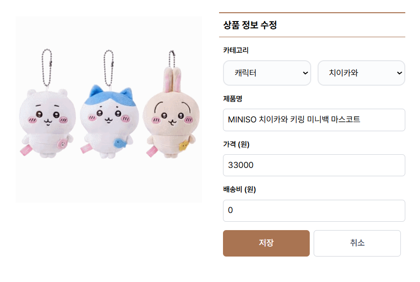

<h1 align="center">온라인 소품샵 도토리섬 🐿️</h1>

<p align="center">
  
</p>

<div align="center">
  <a href="https://www.notion.so/10-console-10g-22973873401a80f4b617c2698ca08bab?source=copy_link" target="_blank">
    
  </a>
  <a href="https://dotori-island.vercel.app" target="_blank">
    
  </a>
  <a href="https://github.com/FRONTENDBOOTCAMP-13th/Final-10-console.10g/wiki" target="_blank">
  
</a>
</div>

<br/>
<br/>

## ✨ 프로젝트 개요

도토리섬은 귀여운 도토리 캐릭터와 함께하는 키덜트 소품샵 콘셉트의 웹 서비스입니다.<br/>
사용자가 감성적인 피규어, 문구, 인형 등 다양한 소품을 즐겁게 쇼핑할 수 있도록 디자인되었습니다.

이 프로젝트는 프론트엔드 기술 역량을 향상시키고, 협업을 통해 실제 서비스 형태의 웹사이트를 구현하는 것을 목표로 하고 있습니다.

<br/>
<br/>

## 👥 팀 console.10g 소개

<table align="center" border="1" cellpadding="10" cellspacing="0" style="width: 100%; table-layout: fixed; text-align: center;">
  <colgroup>
    <col width="25%">
    <col width="25%">
    <col width="25%">
    <col width="25%">
  </colgroup>
  <thead>
    <tr>
      <th>PM (Project Manager)</th>
      <th>PL (Project Leader)</th>
      <th>데이터 엔지니어</th>
      <th>디자이너 (UI/UX)</th>
    </tr>
  </thead>
  <tbody>
    <tr>
      <td><p align="center"></p></td>
      <td><p align="center"></p></td>
      <td><p align="center"></p></td>
      <td><p align="center"></p></td>
    </tr>
    <tr>
      <td align="center">황유빈</td>
      <td align="center">이선진</td>
      <td align="center">엄현욱</td>
      <td align="center">정예빈</td>
    </tr>
    <tr>
      <td align="center">일정·기획·커뮤니케이션<br> 총괄</td>
      <td align="center">개발 리딩 · 기술 방향<br> 설정 · 코드 품질 관리</td>
      <td align="center">데이터 설계 · 분석<br> · 성능 최적화</td>
      <td align="center">사용자 경험과 비주얼<br> 디자인 담당</td>
    </tr>
    <tr>
      <td align="center"><a href="https://github.com/yubin" target="_blank">
  
</a></td>
      <td align="center"><a href="https://github.com/SJ-1011" target="_blank">
  
</a></td>
      <td align="center"><a href="https://github.com/noognoog" target="_blank">
  
</a></td>
      <td align="center"><a href="https://github.com/yebin-jeong" target="_blank">
  
</a></td>
    </tr>
  </tbody>
</table>

<br/>
<br/>

## 🛠️ 기술 스택

<table align="center" style="width: 100%;">
  <thead>
    <tr>
      <th>구분</th>
      <th>사용 기술</th>
    </tr>
  </thead>
  <tbody>
    <tr>
      <td><strong>프론트엔드</strong></td>
      <td>
        
        
        
        
        
      </td>
    </tr>
    <tr>
      <td><strong>백엔드</strong></td>
      <td>
        
        
        
      </td>
    </tr>
    <tr>
      <td><strong>데이터베이스 / 이미지</strong></td>
      <td>
        
        
      </td>
    </tr>
    <tr>
      <td><strong>배포 / 협업 도구</strong></td>
      <td>
        
        
        
        
        
      </td>
    </tr>
  </tbody>
</table>

<br/>
<br/>

## 📆 개발 일정

<table align="center" border="1" cellpadding="10" cellspacing="0" style="width: 100%;">
  <thead>
    <tr>
      <th>스프린트</th>
      <th>기간</th>
      <th>주요 목표</th>
      <th>핵심 작업</th>
    </tr>
  </thead>
  <tbody>
    <tr>
      <td><strong>Sprint 1</strong></td>
      <td>7/7 ~ 7/17</td>
      <td><strong>디자인 설계 & 공통 컴포넌트 기반 구축</strong></td>
      <td style="text-align: left;">
        - 피그마를 활용한 UI/UX 디자인 기초 설계<br>
        - 프로젝트 초기 세팅 (Next.js, Zustand, TailwindCSS)<br>
        - 버튼, 입력창, 카드 등 <strong>공통 컴포넌트 제작</strong>
      </td>
    </tr>
    <tr>
      <td><strong>Sprint 2</strong></td>
      <td>7/18 ~ 7/24</td>
      <td><strong>페이지 구조 구현 & API 연동 기초</strong></td>
      <td style="text-align: left;">
        - 상품 리스트 / 상세 / 장바구니 페이지 기본 UI 적용<br>
        - Zustand 상태관리 및 API 연동 시작<br>
        - 컴포넌트 재사용 패턴 확립
      </td>
    </tr>
    <tr>
      <td><strong>Sprint 3</strong></td>
      <td>7/25 ~ 7/31</td>
      <td><strong>사용자 흐름 완성 & 폼 처리 로직 구현</strong></td>
      <td style="text-align: left;">
        - 결제 페이지 및 react-hook-form 기반 사용자 입력 처리<br>
        - 관리자 페이지 UI 및 데이터 연동<br>
        - Optimistic UI 패턴 적용 및 테스트
      </td>
    </tr>
    <tr>
      <td><strong>Sprint 4</strong></td>
      <td>8/1 ~ 8/8</td>
      <td><strong>최종 마감 (코드 리팩토링 & 배포)</strong></td>
      <td style="text-align: left;">
        - 반응형 UI 개선 (모바일/데스크탑 완성도 향상)<br>
        - Cloudinary 기반 이미지 최적화<br>
        - 버그 수정, UI 디테일 보완, Vercel 최종 배포
      </td>
    </tr>
  </tbody>
</table>

<br/>
<br/>

## 🔍 프로젝트 구조

```
05_final-project/
├── src/
│   ├── app/
│   │   ├── (user)/
│   │   ├── admin/
│   │   ├── board/
│   │   ├── cart/
│   │   ├── category/
│   │   ├── mypage/
│   │   ├── order/
│   │   ├── products/
│   │   ├── search/
│   │   ├── story/
│   │   ├── unauthorized/
│   │   ├── error.tsx
│   │   ├── layout.tsx
│   │   ├── loading.tsx
│   │   ├── not-found.tsx
│   │   └── page.tsx
│   ├── components/
│   │   ├── common/
│   │   ├── icon/
│   │   └── main/
│   ├── constants/
│   │   └── categories.ts
│   ├── data/
│   │   ├── actions/
│   │   └── stories/
│   ├── hooks/
│   │   ├── useCartSelection.ts
│   │   ├── useHasHydrated.tsx
│   │   ├── useQuantityHandlers.ts
│   │   ├── useRemainingStock.ts
│   │   └── useToggleBookmark.ts
│   ├── stores/
│   │   ├── cartBadgeStore.ts
│   │   ├── cartQuantityStore.ts
│   │   ├── loginStore.ts
│   │   ├── notificationStore.ts
│   │   └── userStore.ts
│   ├── styles/
│   ├── types/
│   └── utils/
├── public/
├── README.md
└── package.json
```

<br/>
<br/>

## 🧩 주요 기능

온라인 쇼핑몰 **도토리섬**은 B2C(Business to Customer) 형태의 서비스로, 관리자가 상품을 등록하면 일반 사용자가 해당 상품을 조회하고 구매할 수 있는 구조입니다.

회원의 유형에 따라 웹사이트에서 이용 가능한 기능이 구분되며,
관리자는 상품 관리 및 운영 기능을, 일반 사용자는 상품 검색과 장바구니, 결제 등의 기능을 사용할 수 있습니다.

<br/>

### 🛍️ 일반 회원 - 상품 상세

<p align="center">
  
</p>

일반 회원은 상품 목록에서 원하는 상품을 클릭하면 해당 상품의 상세 페이지로 이동합니다.

상세 페이지에서는 **구매하기, 찜하기, 장바구니 담기, 공유하기** 등의 기능을 사용할 수 있어 편리하게 쇼핑을 즐길 수 있습니다.

<br/>

### 🛍️ 일반 회원 - 상품 결제

<p align="center">
  
</p>

일반 회원은 원하는 상품을 선택하여 결제할 수 있습니다.

결제 버튼을 누르면 배송 정보, 주문 상품, 결제 금액 등이 정리된 결제 확인 페이지로 이동하며,
해당 페이지에서 실제 결제를 진행할 수 있습니다.

<br/>

### 🛍️ 일반 회원 - 주민증

<p align="center">
  
</p>

도토리섬만의 특별한 기능인 **주민증**은 모든 회원에게 자동으로 발급되는 개인 프로필 카드입니다.

회원은 마이페이지의 주민증에서 프로필 사진과 자기소개를 자유롭게 수정할 수 있으며, 이를 통해 나만의 개성을 표현할 수 있습니다.

<br/>

### 🛍️ 일반 회원 - 마이페이지 주문 내역

<p align="center">
  
</p>

일반 회원은 **마이페이지**에서 자신의 주문 내역을 확인할 수 있습니다.

해당 페이지에서는 **결제 상태, 상품 목록, 상품별 금액**을 확인할 수 있으며,
각 주문 건에 대해 **문의하기** 또는 **리뷰 작성하기** 버튼이 함께 제공되어
원하는 기능으로 빠르게 이동할 수 있습니다.

<br/>

### 🧾 관리자 - 마이페이지 사이트 관리

<p align="center">
  
</p>

관리자는 **마이페이지**를 통해 사이트 전반을 관리할 수 있습니다.

**총 판매량, 총 매출액, 회원 정보 분석** 등 다양한 통계 데이터를 확인할 수 있으며,
상품 등록 및 수정, 주문 내역 관리 등 운영에 필요한 핵심 기능들도 이곳에서 수행할 수 있습니다.

<br/>

### 🧾 관리자 - 상품 관리

<p align="center">
  
</p>

<p align="center">
  
</p>

관리자는 각 상품의 정보를 등록하거나 수정할 수 있습니다.

상품 이미지, 카테고리, 제품명, 가격, 배송비 등 다양한 항목을 직접 설정하여,
일반 회원에게 노출되고 판매될 상품을 효율적으로 관리할 수 있습니다.

<br/>
<br/>

## 🚀 도토리섬 실행 방법

- 로컬에서 프로젝트 실행

```bash
git clone https://github.com/FRONTENDBOOTCAMP-13th/Final-10-console.10g.git
cd Final-10-console.10g
npm install
npm run dev
```

- 웹 사이트 접속

```md
https://dotori-island.vercel.app
```
